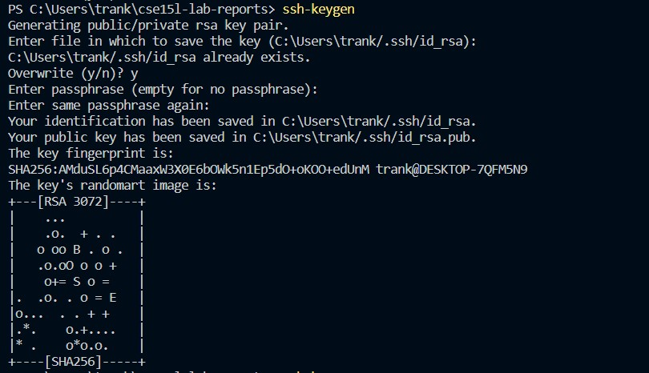
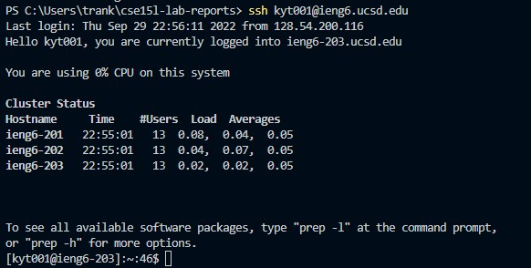
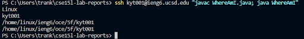

# How to access the UCSD CSE 15L Course Specific Server

Hello!

This page is to show you how to access and use a remote server, specifically UCSD's remote server specific for CSE 15L!

## 1. Installing VSCode

THe first step is to install VSCode. You can do so through this [link](https://code.visualstudio.com/). 

Here's a screenshot of what Visual Studio looks like with the terminal:

## 2. Connecting to Remote Servers

Now, we are going to learn how to remotely connect to the server. First, make sure you have OpenSSH is installed on your compueter. If not, you can learn to do so through this [link](https://learn.microsoft.com/en-us/windows-server/administration/openssh/openssh_install_firstuse?tabs=gui). 

Afterwards, open VSCode. On the navigation bar on the top, click **Terminal*". Then, click "*New Terminal*". A terminal should appear on your screen through VSCode. 

Now we need to find the account you have to use to connect to the server. Go to this [link](https://sdacs.ucsd.edu/~icc/index.php) and input your information into the account lookup. Afterwards, you should see a sequences of characters that begin with "*cs15lfa2022*". That is your account you can use to access the server. You can also use your regular UCSD username if you need to, though not recommended. Now, change your password to the account through this [link](https://sdacs.ucsd.edu/~icc/password.php). Make sure you fulfill the requirements for the password or the password change will fail. After you succeed in changing the password, you will have to wait around 15 mins for UCSD to update your password.

Now that the preparations are done, you can now learn to connect to the remote server. Go back to the terminal on VSCode and type the following command into the terminal:

`ssh <username>@ieng6.ucsd.edu`

>"username" is where your username goes (the word starting with cs15lfa2022...). 

It will ask you if you want to continue connecting. Type **yes**.

Afterwards, it will prompt you to type your password. Type your password correctly. You might notice that if you type, nothing you typed appears on the terminal. For privacy reasons, your password will not appear on the screen as you type. As long as you type it correctly, then you should be able to access the server. If you are unable to correctly type your passwords, get assistance from someone experienced nearby to help or change your password again. It will definitely take more than one try on your first time.

Afterwards, you should get this message in the terminal:

That means you successfully connected to the server!

## 3. Using Commands

Next, you can try out some commands in both your local computer and the remote computer. Here are a few examples

1. `cd` - change directory
2. `pwd` - print working directory
3. `ls` - lists files in current directory
4. `cat` - prints all files in the current directory

If you try running these commands on both your local computer and the remote computer, you'll get different results. That's because when you are logged in to the remote, you are in a different computer entirely. Therefore, you won't have access to the files on your own local computer.

## 4. Copying files with SCP

 So what happens if you want to access a file that is on your local computer, but not the remote computer. Well you can use `scp` to copy that file from your computer to the remote computer. 

`scp <file> <username>@ieng6.ucsd.edu <path>`

> path is where you want to copy it to on the remote computer

With this, you now have access to the copied file on the remote computer!

Here is an example of `scp` in action:

## 5. Setting up an SSH key

Entering the password everytime you want to use the remote computer is very annoying and can take a lot of time since you will use it often. A SSH key will allow you to use `ssh` and `scp` without entering a password.

To do this, we will use a program called **ssh-keygen**. It produces two keys: a puiblic key and a private key. The public key is copied onto the server (the remote computer) and the private key is kept in the client (local computer).

First, you type in `ssh-keygen` into the terminal. It will prompt you to type in where you want to store the keys and a passphrase, but you can just press enter for the default. This is what it should appear on your terminal.

>The overwrite line only appears if a private key already exists

Now you need to copy the public key into the remote computer. Notice that there is a line that tells you where the public key has been saved. The public key is `id_rsa.pub`. 

Now we need to copy this public key file to the remote computer. Recall how we copied files to the remote computer using `scp`:

`scp <path where the public key file is> <username>@ieng6.ucsd.edu:~/.ssh/authorized_keys`

Now you should be able to access the remote computer without a password. It should look something like this:

## 6. Optimizing Remote Running

There are ways you can make your remote running more pleasant. For example, instead of:

1. copying a file with `scp` to the remote server
2. logging into the remote computer with `ssh`
3. compiling a class file from a java file with `javac`
4. running a class with `java`

You can just use one line like this instead:

Now, you only have to wait for one command to run rather than 4!

**Much Faster!**

## 7. Conclusion

With that, you know the basics of accessing a remote server!

