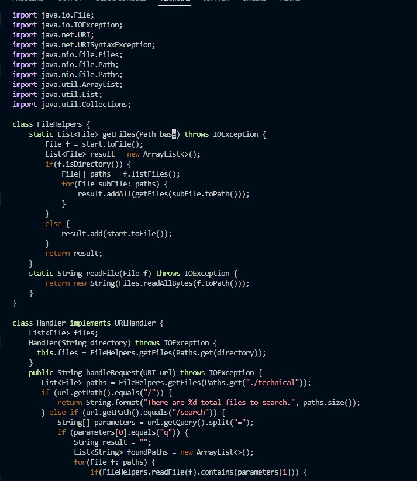

# Lab 5

## Sequence of keys to change start to base in getFiles() of DocSearchServer.java

1. First, type vim DocSearchServer.java to be able to edit the java file.

2. Next, type the key sequence below:

`/start<Enter>cebase<Esc>ncebase<Esc>ncebase<Esc>:wq`

- `/start<Enter>` will search for the first instance of start tine file and jump to it

- `ce` will delete the word 'start' and edit insert mode

- You type `base` since you are already in insert mode

- `<Esc>` to exit insert mode

- `n` to jump to the next instance of what you last searched for. In this case, it will jump to the next instance of 'start'

- Then you retype `cebase<Esc>` to replace 'start' with 'base'. You repeat this process until you replace all the 'start' with 'base' in getFiles(). Since there is only one more 'start' in getFiles(), you do `cebase<Esc>` one more time

3. Now, the 'start' parameter in getFiles() have been changed to 'base'

## Part 2

Q. Which of these two styles would you prefer using if you had to work on a program that you were running remotely, and why?

A. Between editing on Vim on Remote Server versus editing on local then using `scp`, if there isn't a lot of files required to copy over to the remote server, I'd rather edit on local then copy it over because of habits. I'm just use to editing on an IDE and it's more flexible for me. I don't have to memorize different commands to move and edit around. Instead, I can just click around and type to edit. However, if there are a lot of files to copy, then that means it will take a lot of time to copy over to the remote server each time. Then, I'll use vim to edit on the remote serer

Q, What about the project or task might factor into your decision one way or another? (If nothing would affect your decision, say so and why!)

A. Like I mentioned previously, it depends on how much files I would have to copy over each time. If there were a lot, that means it would take too much time to copy over all the files. Therefore, it is much more convenient to edit on the remote server through vim.
