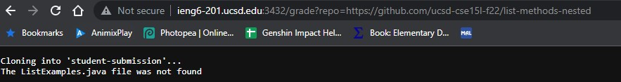
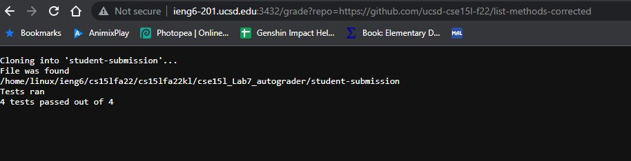
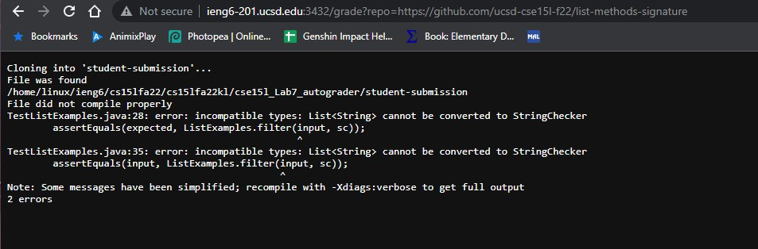

# Lab Report 6

```
# Create your grading script here

#set -e

rm -rf student-submission
git clone $1 student-submission

cp TestListExamples.java student-submission
cp -r lib student-submission
cd student-submission

if [ -e ListExamples.java ]
then
    echo "File was found"
else
    echo "The ListExamples.java file was not found"
    exit 1
fi

classpath=".:lib/hamcrest-core-1.3.jar:lib/junit-4.13.2.jar"
pwd
javac -cp .:lib/hamcrest-core-1.3.jar:lib/junit-4.13.2.jar *.java 2> err.txt

if [ $? -eq 1 ]
then
    echo "File did not compile properly"
    cat err.txt
    exit 1
fi

java -cp .:lib/hamcrest-core-1.3.jar:lib/junit-4.13.2.jar org.junit.runner.JUnitCore TestListExamples 2> err.txt > out.txt

echo "Tests ran"

#cat err.txt

fails=$(head -n 2 out.txt | tail -n 1 | grep -o "E" | wc -l)
tests=$(head -n 2 out.txt | tail -n 1 | grep -o "\." | wc -l)

echo "$(($tests - $fails))" tests passed out of $tests
#cat out.txt
exit
```

## The autograder tested on 3 different submissions








## Tracing the Second Test

```
rm -rf student-submission
git clone $1 student-submission
```
This will delete the previous student's submission and git clone the next student's submission. The standard output will be `Cloning into 'student-submission'`

```
cp TestListExamples.java student-submission
cp -r lib student-submission
cd student-submission
```
This next part will simply copy paste `TestListExamples.java` and the libraries in the 'lib' directory into student-submission then go into the student-submission directory.

```
if [ -e ListExamples.java ]
then
    echo "File was found"
else
    echo "The ListExamples.java file was not found"
    exit 1
fi
```

Next, since the ListExamples.java file is in the student-submission, the standard output will print 'File was Found'

```
pwd
javac -cp .:lib/hamcrest-core-1.3.jar:lib/junit-4.13.2.jar *.java 2> err.txt

if [ $? -eq 1 ]
then
    echo "File did not compile properly"
    cat err.txt
    exit 1
fi
```

This part will compile the files in the directory. Since all of the files were able to compile correctly, the return code would be 0, indicating that there is no error. Therefore, the script will pass through the if statement. Additionally, the currecnt working directly will be outputted in standard output.

```
java -cp .:lib/hamcrest-core-1.3.jar:lib/junit-4.13.2.jar org.junit.runner.JUnitCore TestListExamples 2> err.txt > out.txt

```
Here, we ran the TestListExamples class to ensure the student's code outputs the correct output. The output of this class will be stored in out.txt and err.txt.

```
fails=$(head -n 2 out.txt | tail -n 1 | grep -o "E" | wc -l)
tests=$(head -n 2 out.txt | tail -n 1 | grep -o "\." | wc -l)

echo "$(($tests - $fails))" tests passed out of $tests
```

Finally, we store how many errors and tests were run based off how many E's and .'s were in line 2 of out.txt in the 'fails' and 'tests' variables then output the students score in standard output. Then we exit. Since everything was run properly, the exit code will be 0.